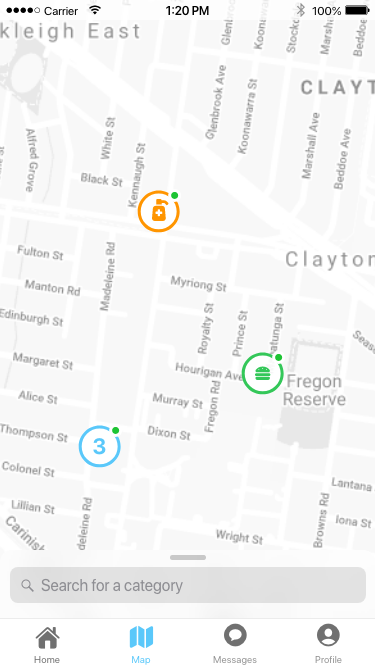

# WeShare

> Online platform for sharing and asking for help

## Motivation

During the coronavirus crisis, many people have got into trouble and are having a hard time. 
They are really in need of help and supplements, that could be the people that cannot afford their living, 
or even the health practitioners that cannot find enough medical equipment.  
Meanwhile, there are also kind people willing to help. 

I saw a lot of gracious activities, where people provide help and items for free (face masks, rice, hand sanitiser, etc.). 
But usually, people in need of these items can only come across these activities on the street or on social media. 
Furthermore, the people in need may hesitate to ask for help. 

Unfortunately, there haven’t been any platforms to directly connect between people in need and the donors.
The idea of WeShare app comes up, this app will serve as a platform between the people seeking for help and people willing to help. 
I also hope that when someone gets help, he will pay it forward and help others, hence together making a better community.

## Key Features

- Making a post either asking for or giving help. For example, "Giving away hand sanitizer" with quantity of 10 bottles.

- Viewing nearby listings and decide which one to contact with.

- Sharing activity (giving - taking) on social platforms.

- Give acknowledgements to supporters.

## Screens

| Login | Home Screen | 
| :---: |:---:| 
|  |  | 

| Listing Details | Nearby Listings | 
| :---: |:---:|
|  |  |

| Map View | Map View Info | 
| :---: | :---: |
|  |  |

| Settings | Profile |
| :---: |:---:|
|  |  |

| Chat | New Listing | Activity Review | 
| :---: |:---:| :---:|
|  |  |  |

## Acknowledgements

- [UIImageView Round Frame](https://stackoverflow.com/questions/25476139/how-do-i-make-an-uiimage-view-with-rounded-corners-cgrect-swift)

- [ImagePicker](https://stackoverflow.com/questions/25510081/how-to-allow-user-to-pick-the-image-with-swift)

- [Share on Facebook](https://stackoverflow.com/questions/46690231/share-on-facebook-ios-11-swift)

- [Take screenshot of UIView](https://www.youtube.com/watch?v=TkUeY_aQyeI)